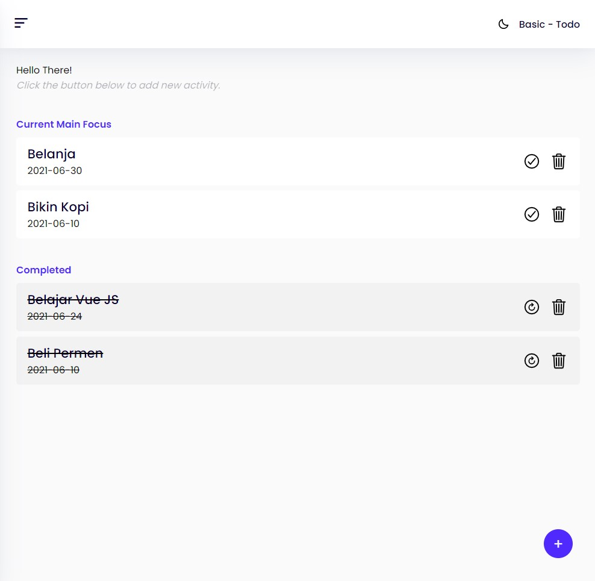

<h1 align="center">JSTodoApp</h1>

JSTodoApp is a web-based application created to manage your to-do lists, easy to use, and can be accessed on mobile devices, laptops, computers and even smart TVs, made with JavaScript and SASS.

## Links

[Repo](https://github.com/mlnzyx/JSTodoApp "JSTodoApp")
  
[Live Demo](https://jstodo.vercel.app/ "Demo")

## Screenshots

## Made with
JavaScript and SASS
